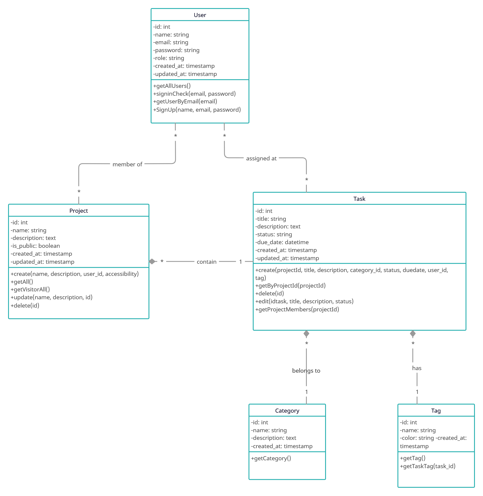

# abdelmouhaimine_eljassimi_project

**TaskFlow - Application web simple de gestion de tâches**

**Author du Brief:** Iliass RAIHANI.

**Author:** eljassimi abdelmouhaimine.

## Links

- **GitHub Repository :** [View on GitHub](https://github.com/Youcode-Classe-E-2024-2025/abdelmouhaimine_eljassimi_project.git)

## UML Diagramme de classe : 

# Configuration et Exécution du Projet

### Prérequis
* **Node.js** et **npm** installés (téléchargez [Node.js](https://nodejs.org/)).
* **Laragon** installé (téléchargez [Laragon](https://laragon.org/download/)).

### Étapes d’installation

1. **Cloner le projet** :
   - Ouvrir un terminal et exécuter :  
     `git clone https://github.com/Youcode-Classe-E-2024-2025/abdelmouhaimine_eljassimi_project`

2. **Placer le projet dans le dossier Laragon** :
   - Cliquez sur le bouton **Root** dans Laragon pour ouvrir le dossier `www` (par défaut, `C:\laragon\www`).
   - Le chemin de votre projet devrait être `C:\laragon\www\abdelmouhaimine_eljassimi_project`.

3. **Configurer la base de données** :
   - Faites un click droit sur **Laragon**, puis allez dans **Tools** > **Quick Add** et téléchargez **phpMyAdmin** et **MySQL**.
   - Ouvrir **phpMyAdmin** via Laragon :
     - Dans Laragon, cliquez sur le bouton **Database** pour accéder à phpMyAdmin (username = `root` et mode de passe est vide).
     - La base de données est automatiquement créez ou vous pouvez Créez une base de données `task_manager` et importez le fichier `database.sql` (disponible dans le dossier `/database/`).

4. **Installer les dépendances Node.js** :
   - Ouvrez un terminal dans le dossier du projet cloné.
   - Exécutez :  `npm install` or `npm i`

5. **Configurer Laragon pour le serveur local** :
   - Lancez **Laragon** et démarrez les services **Apache** et **MySQL**,en Clickant sur **Start All**.

6. **Exécuter le projet** :
   - Une fois les services lancés dans Laragon, cliquez sur le bouton **Web** pour accéder à `http://localhost/abdelmouhaimine_eljassimi_project` dans votre navigateur.

## **Contexte du projet:**

Afin de mieux gérer le travail de l'entreprise le CTO vous demande de fournir une interface intuitive pour les membres des équipes, ainsi qu’un tableau de bord pour les chefs de projet, permettant une gestion efficace des tâches, des membres, et des échéances. L'objectif est de créer un environnement où les membres d’équipes peuvent collaborer, suivre les progrès des projets, et atteindre leurs objectifs dans les délais impartis, tout en utilisant des outils performants et ergonomiques.
​

### Fonctionnalités principales

​

Gestion des Tâches :

    Création de tâches basiques
    Création de tâches spécifiques (Bug, Feature)
    Changement de statut des tâches
    Attribution à un utilisateur

​

Interface Simple :

​
    Liste de Projets
    Liste des tâches
    Formulaire de création
    Page de détail d'une tâche
    Vue des tâches par utilisateur

​

User Stories

​

En tant que chef de projet :

Gestion des projets :

    Je veux pouvoir créer, modifier, et supprimer des projets pour structurer le travail de l’équipe.

​

Gestion des tâches :

    Je veux assigner des tâches aux membres pour une meilleure répartition des responsabilités.
    Catégoriser mes tâche en gérant des catégories.
    Tager mes tâche en gérant des tags.

​

Suivi de l’avancement :

Je souhaite consulter l’état des tâches pour m'assurer que le projet avance comme prévu.

​

En tant que membre d’équipe :

Inscription et connexion :

    Je veux pouvoir m’inscrire avec mon nom, mon e-mail et un mot de passe pour accéder à mon compte.
    Je souhaite me connecter de manière sécurisée pour consulter et mettre à jour mes tâches.

​

Participation aux projets :

    Je veux accéder aux projets auxquels je suis assigné pour consulter les tâches et échéances.
    Je souhaite mettre à jour le statut de mes tâches pour informer l’équipe de mon avancement.

​

En tant qu’utilisateur invité :

**- **Je veux pouvoir visualiser les projets publics pour découvrir les activités des équipes.

    Je souhaite m’inscrire si je décide de rejoindre une équipe ou créer mes propres projets.